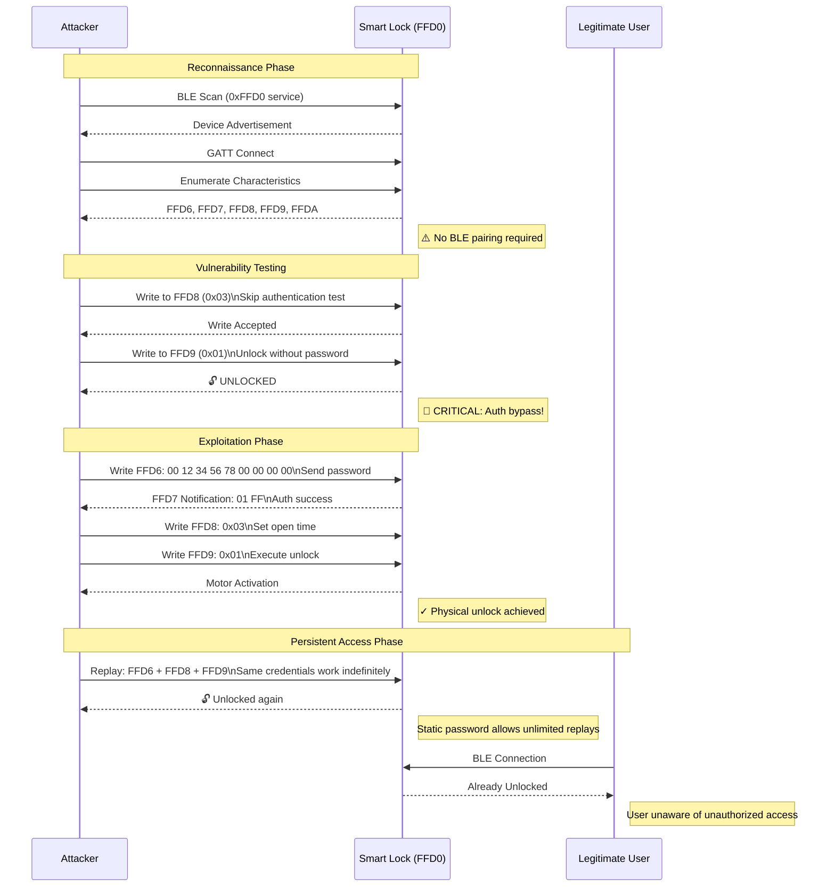

```
If you are using ble_assessment.py

# Discover devices
python3 ble_assessment.py --discover

# Run all tests on a device
python3 ble_assessment.py -m 20:C3:8F:D9:3C:7C

# Run specific tests
python3 ble_assessment.py -m 20:C3:8F:D9:3C:7C --tests auth,dos

# Custom output directory
python3 ble_assessment.py -m 20:C3:8F:D9:3C:7C --output my_reports
```

## Smart Lock Attack Flow (BLE)

```mermaid
sequenceDiagram
    participant Design
    participant Implementation
    participant Result

    rect rgb(60, 60, 60)
        Note over Design,Implementation: Root Cause 1: No BLE Pairing Required
        Design->>Implementation: Pre-pairing GATT access allowed
        Implementation-->>Result: Anyone can connect without authorization
        Design->>Implementation: No encryption enforced
        Implementation-->>Result: Password transmitted in cleartext
        Design->>Implementation: Device accepts any connection
        Implementation-->>Result: No user authentication needed
        Note right of Result: 🚨 CRITICAL: Unauthenticated access
    end

    rect rgb(60, 60, 60)
        Note over Design,Implementation: Root Cause 2: Static Password Authentication
        Design->>Implementation: Password never expires
        Implementation-->>Result: Replay attacks always work
        Design->>Implementation: No challenge-response mechanism
        Implementation-->>Result: Passive sniffing reveals credentials
        Design->>Implementation: Same password works forever
        Implementation-->>Result: One compromise = permanent access
        Note right of Result: 🚨 CRITICAL: Credential reuse
    end

    rect rgb(60, 60, 60)
        Note over Design,Implementation: Root Cause 3: Inadequate State Machine
        Design->>Implementation: No authentication state validation
        Implementation-->>Result: FFD8+FFD9 works without FFD6
        Design->>Implementation: Steps can be skipped
        Implementation-->>Result: Authentication bypass possible
        Design->>Implementation: No session timeout
        Implementation-->>Result: Auth persists indefinitely
        Note right of Result: 🚨 CRITICAL: State machine bypass
    end

    rect rgb(60, 60, 60)
        Note over Design,Implementation: Root Cause 4: Weak Protocol Design
        Design->>Implementation: 9-byte password with low entropy<br/>Only 5 unique bytes: 00,12,34,56,78
        Implementation-->>Result: Reduced effective keyspace
        Design->>Implementation: Predictable structure<br/>[header:1][password:4][padding:4]
        Implementation-->>Result: Pattern analysis possible
        Design->>Implementation: No rate limiting
        Implementation-->>Result: Brute force feasible
        Note right of Result: ⚠️ HIGH: Weak cryptography
    end
```



